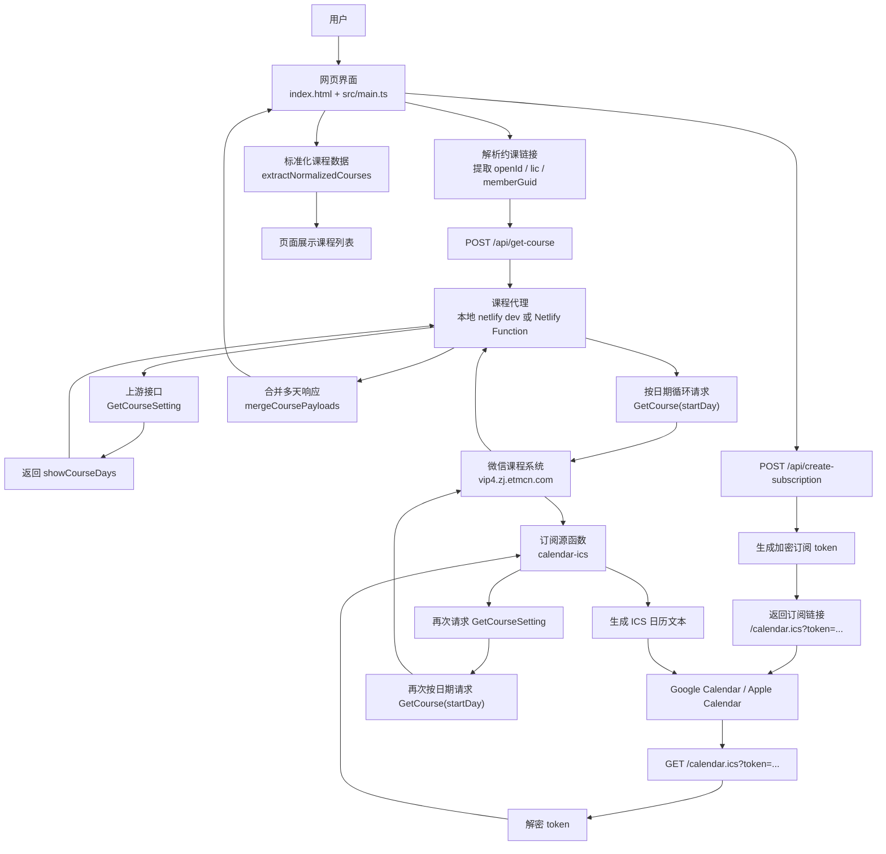
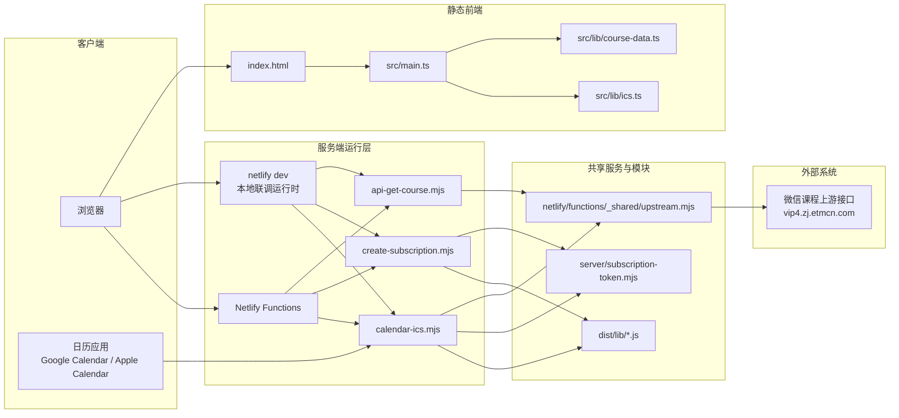

# 数据流图与系统架构图

本文档基于当前项目实现整理，覆盖本地 `netlify dev` 联调和 Netlify 部署两种运行方式。

## 数据流图

## 系统架构图

## 关键说明

- 前端本身不直接请求上游微信接口，而是统一走 `/api/get-course`，避免浏览器 CORS 限制。
- `GetCourseSetting` 用来拿 `showCourseDays`，服务端会据此循环请求多天的 `GetCourse(startDay)`。
- 订阅链接中的 `token` 不是明文参数，而是由 `server/subscription-token.mjs` 加密后的结果。
- 日历应用不是被动接收推送，而是定期重新请求 `/calendar.ics`，每次请求时服务端都会重新抓取最新课程并生成新的 ICS。
